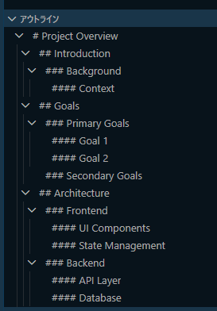
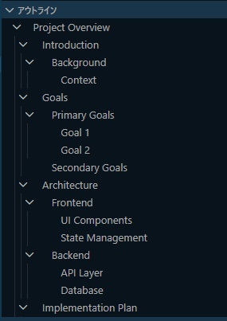

# replace_vscode_outline_hash

VSCode のアウトラインビューで Markdown の見出しに表示される `#` 記号を取り除く PowerShell スクリプトです。アウトラインを見やすくします。

## 説明

デフォルトでは、VSCode のアウトラインパネルには `#` 記号付きで見出しが表示されます：

```
# My Heading
## Section
### Subsection
```

このスクリプトは VSCode 内部の `serverWorkerMain.js` にパッチを当て、`#` 記号なしで見出しを表示します：

```
My Heading
  Section
    Subsection
```






## 必要環境

- Windows
- PowerShell 5.1 以降
- Visual Studio Code がインストール済みで、`code` コマンドが `PATH` に通っていること

## 使い方

> **⚠️ 管理者として実行してください**
> VSCode のインストールディレクトリへの書き込みには管理者権限が必要です。

1. PowerShell を**管理者として**開く。
2. スクリプトを実行する：

```powershell
.\replace_vscode_outline_hash.ps1
```

スクリプトは以下の処理を行います：

1. `PATH` から `code` の実行ファイルを特定
2. VSCode のインストールディレクトリを特定
3. インストール内の `serverWorkerMain.js` を検索
4. バックアップを作成（`serverWorkerMain.js.bak`）
5. アウトラインから `#` を取り除くための文字列置換を実行

実行後、**VSCode をリロード**（または再起動）すると変更が反映されます。

## 元に戻す方法

元の動作に戻すには、バックアップファイルをコピーして上書きしてください：

```powershell
Copy-Item "path\to\serverWorkerMain.js.bak" "path\to\serverWorkerMain.js" -Force
```

## 注意事項

- このスクリプトは VSCode インストール内の JS ファイルにパッチを当てます。**VSCode をアップデートするとパッチが上書きされる**ため、アップデート後に再実行が必要になります。
- VSCode が管理者権限を必要とする場所（例：`C:\Program Files`）にインストールされている場合は、管理者として実行する必要があります。
- 対象の文字列が見つからない場合（VSCode アップデートでファイルが変わった場合など）、スクリプトは何も変更せずに終了します。

## ライセンス

MIT
